# Week 2: Metrics Setup

Complete documentation for Production Metrics (Azure Application Insights) and Product Metrics (Google Analytics 4) integration.

---

## 📊 Overview

Week 2 focuses on implementing comprehensive monitoring and analytics for the application:

- **Production Metrics**: Azure Application Insights for backend API monitoring (logs, errors, performance)
- **Product Metrics**: Google Analytics 4 for frontend user behavior tracking (page views, events, sessions)

---

## 🔧 Azure Application Insights (Backend)

### Overview

Azure Application Insights is integrated with the backend API for production metrics and observability.

### Features

- **HTTP Request Tracking**: All API requests are automatically tracked with duration, status codes, and response times
- **Custom Events**: Authentication events (login, signup, logout, refresh, failed attempts) are tracked with user context
- **Exception Tracking**: Errors are automatically captured with stack traces and request context
- **Performance Metrics**: Request duration, server health (CPU, memory), and dependency tracking
- **Live Metrics**: Real-time monitoring dashboard for immediate insights

### Setup

#### 1. Get Connection String

1. Navigate to Azure Portal → Application Insights → `week1-api-insights`
2. Go to Overview → Connection string
3. Copy the connection string

#### 2. Add to Kubernetes Secret

```bash
# Encode connection string to base64
$connectionString = "InstrumentationKey=xxx;IngestionEndpoint=https://xxx"
$b64 = [Convert]::ToBase64String([Text.Encoding]::UTF8.GetBytes($connectionString))

# Patch secret
kubectl patch secret week1-api-secrets --type=merge -p "{\"data\":{\"APPLICATIONINSIGHTS_CONNECTION_STRING\":\"$b64\"}}"
```

#### 3. Restart Deployment

```bash
kubectl rollout restart deployment/week1-api
kubectl rollout status deployment/week1-api
```

#### 4. Verify Initialization

```bash
kubectl logs -l app=week1-api | grep "Application Insights"
```

Expected output:
```
[AppInsights] Application Insights initialized successfully
```

### Environment Variable

Add to Kubernetes Secret (optional):

```bash
APPLICATIONINSIGHTS_CONNECTION_STRING=<connection-string>
```

**Note:** This is optional. If not set, Application Insights will be disabled (graceful degradation).

### Access Metrics

#### Live Metrics

- **Location**: Azure Portal → Application Insights → Live Metrics
- **Use Case**: Real-time monitoring of request rate, duration, failures
- **Refresh**: Updates every few seconds

#### Performance Metrics

- **Location**: Azure Portal → Application Insights → Performance → Operations
- **Use Case**: Analyze request duration, identify slow endpoints
- **Metrics**: Request count, average duration, failure rate

#### Logs & Analytics (Kusto Queries)

- **Location**: Azure Portal → Application Insights → Logs

**Common Queries:**

```kusto
// Recent requests
requests 
| where timestamp > ago(1h) 
| order by timestamp desc
| project timestamp, name, url, resultCode, duration, success

// Authentication events
customEvents 
| where name == "Authentication" 
| where timestamp > ago(1h)
| project timestamp, name, customDimensions.action, customDimensions.userId

// Exceptions
exceptions 
| where timestamp > ago(1h) 
| order by timestamp desc
| project timestamp, type, message, outerMessage

// Failed requests (status >= 400)
requests 
| where timestamp > ago(1h)
| where resultCode >= 400
| order by timestamp desc
| project timestamp, name, url, resultCode, duration

// Request duration by endpoint
requests 
| where timestamp > ago(24h)
| summarize avg(duration), count() by name
| order by avg_duration desc
```

### Implementation Details

#### Architecture

- **Middleware**: `backend/src/middlewares/appInsightsTracking.ts` - Manual request tracking for reliability
- **Initialization**: `backend/src/libs/appInsights.ts` - Singleton pattern, graceful degradation if connection string missing
- **Configuration**: 
  - Auto-collection disabled (`setAutoCollectRequests(false)`)
  - Manual tracking enabled for better control
  - Sampling: 100% (all requests tracked) - adjust in production based on volume
  - Batch size: 250 requests, batch interval: 15 seconds

### Graceful Degradation

If `APPLICATIONINSIGHTS_CONNECTION_STRING` is not set, Application Insights is disabled and the application continues to function normally. Check logs for initialization status:

```bash
kubectl logs -l app=week1-api | grep "Application Insights"
```

Expected output if disabled:
```
[AppInsights] Connection string not found, Application Insights disabled
```

---

## 🚨 Azure Alerts

### Overview

Azure Application Insights alerts are configured to monitor critical metrics and notify via email.

### Alert Rules

#### 1. Exception Rate Critical

- **Condition**: Exception rate exceeds 5% of requests in 5 minutes
- **Severity**: Critical
- **Query**: Log-based alert using Kusto query
- **Action**: Email notification to Action Group

#### 2. Failed Requests Alert

- **Condition**: Failed requests (status code >= 400) detected
- **Severity**: Critical
- **Query**: Log-based alert using Kusto query
- **Action**: Email notification to Action Group

#### 3. Server Unavailable Alert

- **Condition**: Server health check fails (no successful requests in 5 minutes)
- **Severity**: Critical
- **Query**: Log-based alert using Kusto query
- **Action**: Email notification to Action Group

#### 4. High Response Time Warning

- **Condition**: Average response time exceeds threshold
- **Severity**: Warning
- **Query**: Log-based alert using Kusto query
- **Action**: Email notification to Action Group

#### 5. Elevated Exceptions Warning

- **Condition**: Exception count is elevated (above baseline)
- **Severity**: Warning
- **Query**: Log-based alert using Kusto query
- **Action**: Email notification to Action Group

### Access Alerts

- **Location**: Azure Portal → Application Insights → Alerts → Alert History
- **Email Notifications**: Sent to configured Action Group
- **Alert Status**: Fired, Resolved, or Suppressed

### Alert Configuration

**Note:** Alerts use log-based queries (Kusto) for reliable detection of failed requests and exceptions, as metric-based alerts may not capture all scenarios.

**Action Group:**
- Name: `week1-api-alerts-action-group`
- Email notifications enabled
- Configured in Azure Portal → Monitor → Action Groups

---

## 📈 Google Analytics 4 (Frontend)

### Overview

Google Analytics 4 is integrated with the frontend application for product metrics and user behavior tracking.

### Features

- **Page View Tracking**: Automatic tracking of all route changes (Login, Signup, Home, Profile, etc.)
- **Custom Events**: Authentication events (login, signup, logout, failed attempts) tracked with user context
- **Real-time Reports**: Live user activity, page views, and events
- **User Engagement**: Session tracking, user flow analysis

### Setup

#### 1. Get Measurement ID

1. Navigate to Google Analytics 4 → Admin → Data Streams
2. Select Web stream
3. Copy Measurement ID (format: `G-XXXXXXXXXX`)

#### 2. Add to Environment Variables

Create `.env` file in `frontend/` directory:

```bash
VITE_GA_MEASUREMENT_ID=G-XXXXXXXXXX
```

#### 3. Rebuild and Deploy

```bash
cd frontend
npm run build
npm run deploy
```

**Note:** Environment variables must be set at build time for Vite applications.

### Access Analytics

#### Real-time Reports

- **Location**: Google Analytics 4 → Reports → Realtime
- **Use Case**: Monitor live user activity
- **Metrics**: Active users, page views, events in last 30 minutes

#### Events Report

- **Location**: Google Analytics 4 → Reports → Engagement → Events
- **Use Case**: Analyze event frequency and user behavior
- **Metrics**: Event count, unique users, event value

#### User Activity

- **Location**: Google Analytics 4 → Reports → User → User activity
- **Use Case**: Track individual user journeys
- **Metrics**: User paths, page views per session, session duration

### Implementation Details

#### Architecture

- **Initialization**: `frontend/src/services/analytics.ts` - Singleton pattern, initialized on app startup
- **Page Tracking**: `frontend/src/components/GoogleAnalytics.tsx` - React Router integration for automatic page views
- **Event Tracking**: Custom events for authentication flows, form submissions, errors
- **PII Protection**: No personally identifiable information (PII) is sent to GA4

#### Tracked Events

| Event | Category | Action | When Triggered |
|-------|----------|--------|----------------|
| Page View | Page | View | Route change (automatic) |
| Login | Authentication | login | Successful login |
| Signup | Authentication | signup | Successful signup |
| Logout | Authentication | logout | User logout |
| Login Failed | Authentication | failed | Failed login attempt |
| Error | Error | error | Frontend error caught |

### Environment Variable

```bash
VITE_GA_MEASUREMENT_ID=G-XXXXXXXXXX
```

**Note:** This is optional. If not set, Google Analytics will be disabled (graceful degradation).

---

## 📸 Screenshots & Real Data

### Azure Application Insights

#### Live Metrics


**Description**: Real-time monitoring dashboard showing:
- Request rate (requests/second) in real-time
- Response time chart with average duration
- Failed requests count
- Server metrics (CPU, Memory)
- Sample requests with status codes

**Key Metrics Observed**:
- Active requests being processed
- Average response time
- Success/failure rate
- Live server health status

#### Performance Dashboard
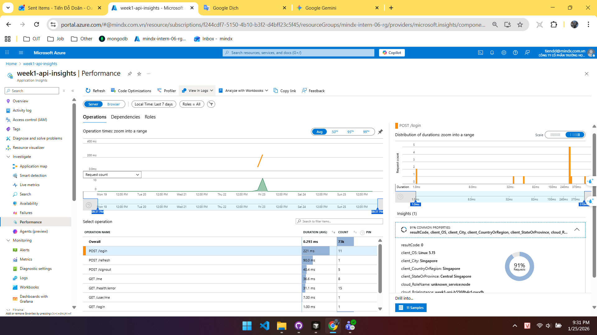

**Description**: Performance overview showing:
- Operations list with average duration
- Top slowest operations (endpoints)
- Request count chart over time
- Failed requests percentage
- Performance breakdown by endpoint

**Key Metrics Observed**:
- Average request duration per endpoint
- Request volume trends
- Failure rates by operation
- Performance bottlenecks identification

#### Recent Requests (Logs Query)
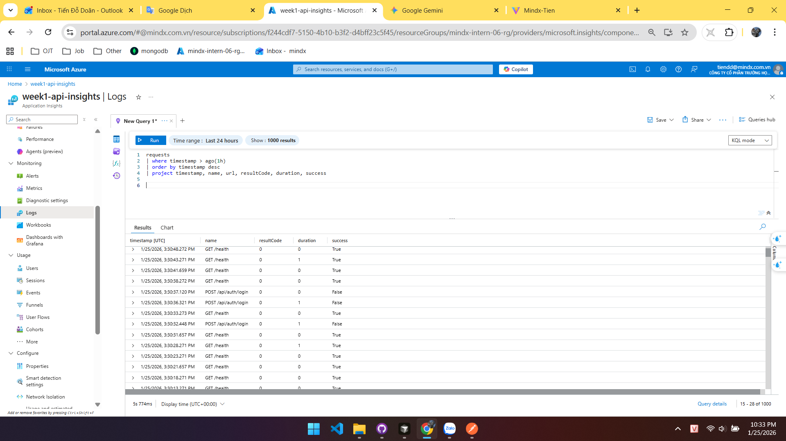

**Query Used**:
```kusto
requests 
| where timestamp > ago(1h) 
| order by timestamp desc
| project timestamp, name, url, resultCode, duration, success
```

**Description**: Logs query results showing:
- Recent API requests with timestamps
- Endpoint names and URLs
- HTTP status codes (200, 400, 500)
- Request duration in milliseconds
- Success/failure status

**Key Observations**:
- Request patterns and frequency
- Response times for different endpoints
- Error rates and status codes
- Request distribution over time

#### Authentication Events (Custom Events)
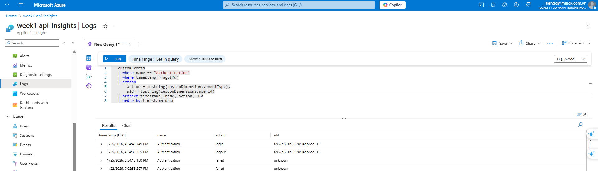

**Query Used**:
```kusto
customEvents 
| where name == "Authentication" 
| where timestamp > ago(1h)
| project timestamp, name, customDimensions.action, customDimensions.userId
```

**Description**: Custom events tracking authentication flows:
- Login events
- Signup events
- Logout events
- Refresh token events
- Failed authentication attempts

**Key Observations**:
- Authentication action types
- User activity patterns
- Failed login attempts
- Token refresh frequency

#### Exceptions Tracking
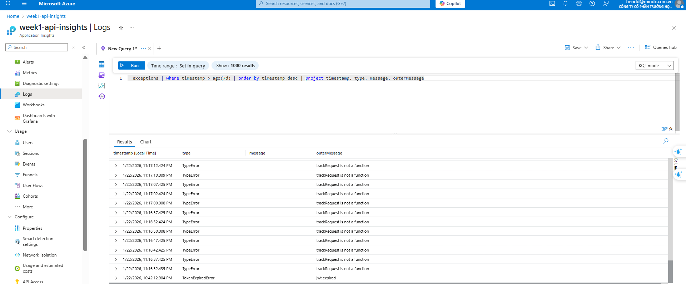

**Query Used**:
```kusto
exceptions 
| where timestamp > ago(1h) 
| order by timestamp desc
| project timestamp, type, message, outerMessage
```

**Description**: Exception tracking showing:
- Exception types and messages
- Stack traces and error details
- Request context for exceptions
- Exception frequency and patterns

**Key Observations**:
- Error types occurring in production
- Exception patterns and trends
- Error context and debugging information

### Azure Alerts

#### Alert Rules List
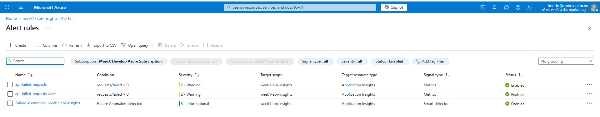

**Description**: List of all configured alert rules:
1. **Exception Rate Critical** - Monitors exception rate exceeding 5%
2. **Failed Requests Alert** - Detects failed requests (status >= 400)
3. **Server Unavailable Alert** - Monitors server health check failures
4. **High Response Time Warning** - Alerts on slow response times
5. **Elevated Exceptions Warning** - Monitors exception count elevation

**Key Information**:
- Alert rule names and descriptions
- Severity levels (Critical/Warning)
- Enabled/Disabled status
- Alert evaluation frequency

#### Alert History
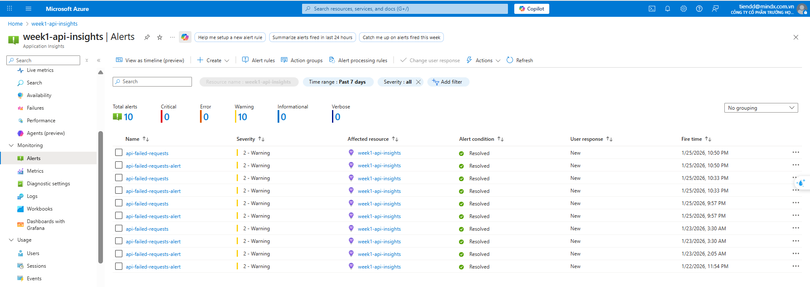

**Description**: Alert history dashboard showing:
- Fired alerts with timestamps
- Alert severity and status
- Resolved alerts
- Alert conditions that triggered
- Notification status

**Key Observations**:
- Alert firing frequency
- Alert resolution time
- Most common alert types
- Alert reliability and accuracy

### Google Analytics 4

#### Real-time Report - Overview
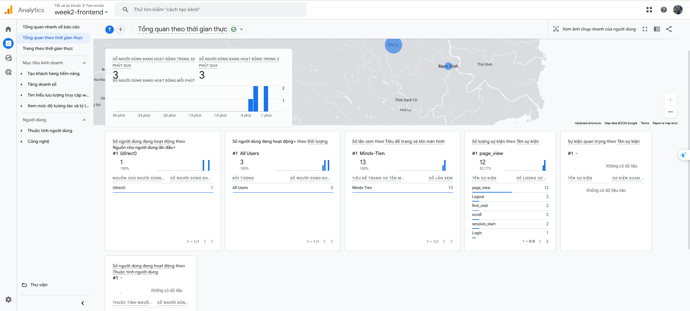

**Description**: Real-time monitoring dashboard showing:
- Active users right now
- Page views in last 30 minutes
- Top pages being viewed
- Top events happening in real-time
- User locations (if available)

**Key Metrics Observed**:
- Current active user count
- Real-time page view rate
- Most popular pages
- Live event tracking

#### Real-time Report - Events
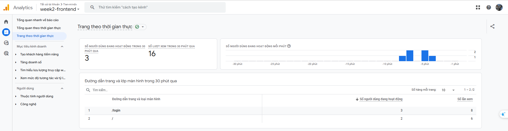

**Description**: Real-time events dashboard showing:
- Events happening right now
- Event count in last 30 minutes
- Event types: page_view, login, signup, logout, login_failed
- Event parameters and values

**Key Observations**:
- Live event tracking
- Authentication events in real-time
- Event frequency and patterns
- User interaction patterns

#### Events Report - Overview
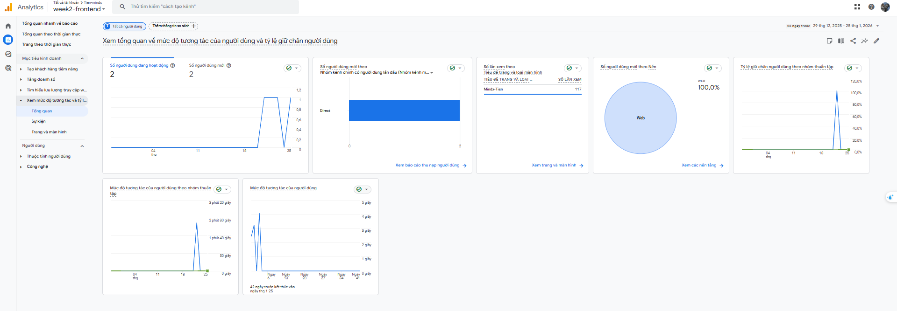

**Description**: Comprehensive events report showing:
- All tracked events with counts
- Total users per event
- Event count per user
- Event value and engagement metrics
- Top events by frequency

**Key Metrics**:
- Total event count
- Unique users per event
- Average events per user
- Event engagement rate

#### Events Report - Event Details
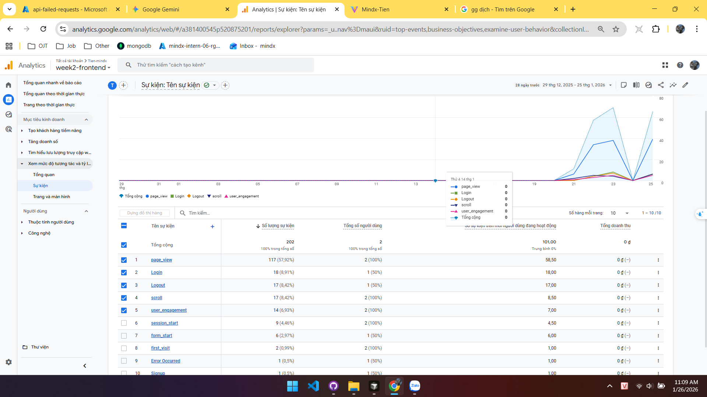

**Description**: Detailed event breakdown showing:
- Event parameters (category, action)
- Event count over time (chart)
- User breakdown by event
- Event value and conversion data
- Event path analysis

**Key Observations**:
- Event trends over time
- User engagement with events
- Event conversion rates
- Event correlation patterns

#### Events Report - Pages and Screens
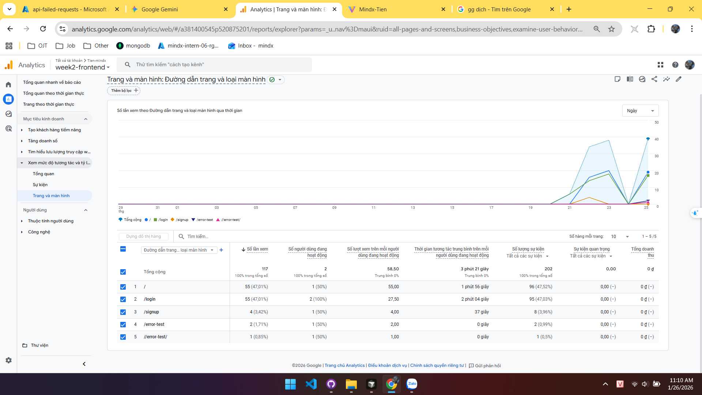

**Description**: Pages and screens report showing:
- Top pages by page views
- Average time on page
- Page views per session
- Page engagement metrics
- User flow through pages

**Key Metrics**:
- Page view counts
- Most visited pages (/login, /signup, /)
- Session duration per page
- Bounce rate and engagement

#### Events Report - Authentication Events Detail


**Description**: Detailed authentication events analysis showing:
- Login events breakdown
- Signup events breakdown
- Logout events
- Failed login attempts
- Authentication success rate
- User authentication patterns

**Key Observations**:
- Authentication event frequency
- Success vs failure rates
- User authentication behavior
- Security insights from failed attempts

---

## 🔍 Troubleshooting

### Application Insights Not Showing Data

1. **Check Connection String**:
   ```bash
   kubectl get secret week1-api-secrets -o jsonpath='{.data.APPLICATIONINSIGHTS_CONNECTION_STRING}' | base64 -d
   ```

2. **Check Pod Logs**:
   ```bash
   kubectl logs -l app=week1-api | grep "Application Insights"
   ```

3. **Verify Middleware**:
   - Ensure `appInsightsRequestTracking` middleware is applied in `server.ts`
   - Check that middleware is placed after `express.json()` and `cookieParser()`

4. **Check Batch Configuration**:
   - Verify batch size and interval settings in `appInsights.ts`
   - Increase batch interval if experiencing timeout issues

### Google Analytics Not Tracking

1. **Check Measurement ID**:
   - Verify `VITE_GA_MEASUREMENT_ID` is set in `.env` file
   - Ensure it's included in build (check `dist/` folder)

2. **Check Browser Console**:
   - Open browser DevTools → Console
   - Look for GA4 initialization messages or errors

3. **Verify Component**:
   - Ensure `GoogleAnalytics` component is included in `App.tsx`
   - Check that React Router is properly configured

### Alerts Not Firing

1. **Check Alert Configuration**:
   - Verify alert rules are enabled in Azure Portal
   - Check Action Group is properly configured

2. **Test Alert Condition**:
   - Manually trigger error endpoint: `GET /api/health/error`
   - Wait 5-10 minutes for alert evaluation

3. **Check Alert History**:
   - Azure Portal → Application Insights → Alerts → Alert History
   - Review fired/resolved status

---

## 📚 Additional Resources

- [Azure Application Insights Documentation](https://learn.microsoft.com/en-us/azure/azure-monitor/app/app-insights-overview)
- [Google Analytics 4 Documentation](https://developers.google.com/analytics/devguides/collection/ga4)
- [Kusto Query Language (KQL) Reference](https://learn.microsoft.com/en-us/azure/data-explorer/kusto/query/)

---

## ✅ Acceptance Criteria Status

- [x] Azure App Insights is integrated with the back-end API
- [x] Application logs, errors, and performance metrics are visible in Azure App Insights
- [x] Alerts are setup and tested on Azure
- [x] Google Analytics is integrated with the front-end app
- [x] Key product metrics (page views, user sessions, events) are tracked in Google Analytics
- [x] Documentation is provided for how to access and interpret both production and product metrics
- [x] All configuration and integration scripts are committed and pushed to the repository

---

**Last Updated**: Week 2 Completion  
**Maintained By**: MindX Engineer Onboarding Team

